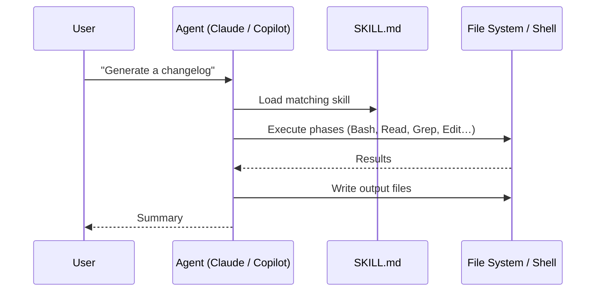

[← Back to README](../README.md)

# Architecture

## Overview

agent-skills is a content repository — there is no compiled code, no runtime, and no server. Each skill is a self-contained directory that an AI agent reads and executes directly.

```
agent-skills/
├── scripts/
│   ├── install.sh          Unix installer
│   └── install.ps1         Windows installer
└── skills/
    └── <skill-name>/
        ├── SKILL.md         Required — instructions the agent follows
        └── evals/
            └── evals.json   Optional — test cases for the skill
```

## How Skills Work

When a skill is installed, the AI agent loads its `SKILL.md` into context whenever it recognises a matching user request. The agent then follows the phases defined in that file, using only the tools listed in the frontmatter.



## Anatomy of a SKILL.md

Every `SKILL.md` has two parts:

### 1. YAML Frontmatter

```yaml
---
name: skill-name
description: >
  One-paragraph description used for skill matching.
  Include trigger phrases here — this is the primary
  mechanism that determines when the skill activates.
tools: Bash, Read, Write, Edit, Glob, Grep
metadata:
  version: 1.0
---
```

- **`name`** — identifier, matches the directory name
- **`description`** — the agent reads this to decide whether to invoke the skill; write it to match real user phrases
- **`tools`** — declares which Claude tools the skill may use; keep this minimal

### 2. Instruction Body

The body is structured as numbered phases. Each phase has:
- A goal statement
- Bash commands to run (with expected output or failure handling)
- Decision logic (if/else branches)
- Output format expectations

## Skill Design Principles

**Idempotent** — re-running a skill must not corrupt existing output. Use `Edit` over `Write` when a file already exists; check for duplicates before appending.

**Graceful degradation** — if an optional tool (`vulture`, `tsc`, `deadcode`) is unavailable, fall back to grep-based analysis rather than failing.

**Read-only by default** — skills that analyse code (find-dead-code, improve-logging) produce reports only. Skills that write files (changelog, document-project) still preserve all existing content.

**Framework-aware** — skills account for runtime patterns that make code appear unused (DI annotations, reflection, decorators) to avoid false positives.

## Evals

Each skill can have an `evals/evals.json` file that defines test scenarios:

```json
{
  "skill_name": "my-skill",
  "evals": [
    {
      "id": 0,
      "prompt": "The user prompt that triggers this scenario",
      "description": "What this test covers",
      "setup": "bash commands to create the test environment",
      "expected_output": "Description of what correct output looks like",
      "files": [],
      "assertions": [
        {
          "id": "assertion-id",
          "text": "Plain-language statement that must be true of the output"
        }
      ]
    }
  ]
}
```

Evals are run by the `skill-creator` skill, which spawns the skill against each test case and grades the assertions.

---

## See Also

- [Getting Started](getting-started.md) — install and first use
- [Contributing a Skill](contributing.md) — how to write a new skill
