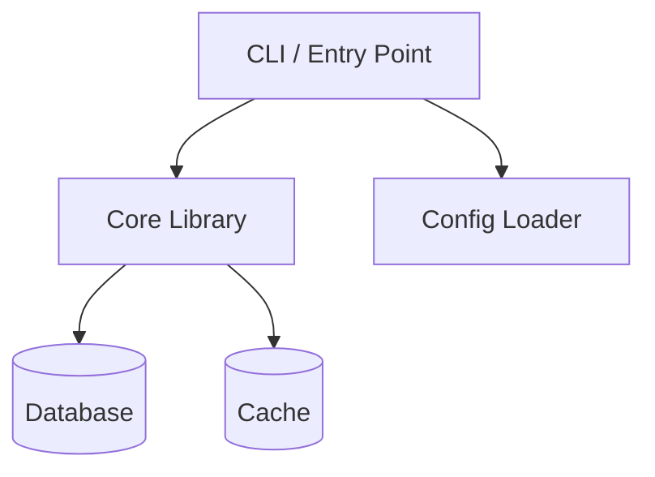

# Document Project

Create or improve project documentation: a minimal root `README.md` that describes the project and links to a `/docs` directory containing all detailed pages. Every file and section is cross-linked so readers can navigate naturally. All diagrams are ASCII or Mermaid — no external image dependencies.

## Phase 1: Understand the Project

### Gather project signals

```bash
# Language / runtime / build tool
ls package.json pyproject.toml Cargo.toml go.mod pom.xml build.gradle \
   Makefile CMakeLists.txt *.sln 2>/dev/null

# Entry points and structure
ls src/ app/ lib/ cmd/ internal/ main.* index.* 2>/dev/null

# Existing documentation (audit before creating anything)
find . -maxdepth 3 -name "*.md" -o -name "*.rst" -o -name "*.adoc" \
   ! -path "*/.git/*" ! -path "*/node_modules/*" 2>/dev/null

# Existing /docs directory
ls docs/ 2>/dev/null

# Test directories
ls test/ tests/ spec/ __tests__/ 2>/dev/null

# CI/CD
ls .github/ .gitlab-ci.yml .circleci/ 2>/dev/null
```

Read `package.json`, `pyproject.toml`, `Cargo.toml`, or equivalent to extract:
- Project name and description
- Version
- License
- Dependencies (to understand scope)

Read existing `README.md` fully if it exists — capture its tone, any content worth keeping, and note what is missing.

### Key questions to answer before writing

| Question                                             | Where to look                                         |
|------------------------------------------------------|-------------------------------------------------------|
| What does this project do?                           | README, package manifest description, main entry file |
| Who is the audience? (end users / developers / both) | README tone, API surface, CLI vs library              |
| How do you install it?                               | package manifest, Makefile, CI scripts                |
| How do you run / use it?                             | scripts section, main file, existing docs             |
| How do you run tests?                                | test config, CI workflow, Makefile                    |
| What are the main components?                        | directory structure, imports, module names            |
| Are there configuration options?                     | env files, config schemas, CLI flags                  |
| Is there a deployment / release process?             | CI/CD, Dockerfile, release scripts                    |

## Phase 2: Audit Existing Documentation

Before creating or editing any file, inventory what already exists:

1. List every `.md` / `.rst` / `.adoc` file and its first heading.
2. Check for content worth preserving (installation steps, API references, diagrams).
3. Identify gaps: what is described in code comments or CI scripts but not documented?
4. Note any outdated content (stale commands, removed flags, old file paths).

**Do not delete existing documentation files.** If content should move from one file to another, copy the useful parts and mark the old file as superseded with a link to the new location.

### Badge audit

If the existing `README.md` contains badges (e.g. `[](...)` or similar), evaluate each one:

**Keep as-is if the badge:**
- Points to a CI workflow that still exists (check `.github/workflows/` or equivalent).
- Reflects the actual license in the repo (`LICENSE` file or manifest).
- Links to a real published package (npm, PyPI, crates.io, etc.) that matches the project name.
- Shows a coverage report that is actually being generated.

**Recommend a change if the badge:**
- References a CI workflow file or job name that no longer exists.
- Shows a version that mismatches the current manifest version.
- Links to a service (e.g. Travis CI, AppVeyor) that the project has migrated away from.
- Is broken (the image URL returns a 404 or "unknown" state).
- Duplicates information already stated in plain text nearby.

For each problematic badge, output a specific suggestion rather than silently removing it:

> ⚠️ Badge `build` links to `.github/workflows/ci.yml` but that file does not exist (found `build.yml` instead). Suggested fix: update the badge URL to reference `build.yml`.

Do **not** remove any badge without explicit user approval. Only flag and explain.

## Phase 3: Plan the Documentation Structure

Choose the page set based on project complexity:

### Minimal (scripts, small libraries, CLIs)

```
README.md
docs/
  getting-started.md
  configuration.md        (if there are config options)
```

### Standard (libraries, services, larger CLIs)

```
README.md
docs/
  getting-started.md
  architecture.md
  configuration.md
  api.md / usage.md
  contributing.md
```

### Full (platforms, frameworks, multi-service projects)

```
README.md
docs/
  getting-started.md
  architecture.md
  configuration.md
  api.md
  deployment.md
  contributing.md
  adr/                    (architecture decision records, if applicable)
    001-*.md
```

Only create pages that have real content to put in them. A placeholder page with "TBD" is worse than no page.

Present the planned structure to the user and wait for approval before writing any files if significant work already exists. For a project with no docs at all, proceed directly.

## Phase 4: Write the Root README.md

The root `README.md` must be **minimal**. Its only jobs are:

1. Say what the project is (1–3 sentences).
2. Show the quickest possible way to install and run it (copy-paste commands).
3. Link to the `/docs` pages for everything else.

### Template

```markdown
# <Project Name>

<One to three sentences: what it does, who it is for, what problem it solves.>

## Quick Start

\`\`\`<lang>
<install command>
<run command>
\`\`\`

## Documentation

- [Getting Started](docs/getting-started.md)
- [Architecture](docs/architecture.md)
- [Configuration](docs/configuration.md)
- [API Reference](docs/api.md)
- [Contributing](docs/contributing.md)

## License

<License name> — see [LICENSE](LICENSE).
```

**Rules:**
- No feature lists, no lengthy explanations, no screenshots.
- Badges are allowed if they pass the audit in Phase 2. Place them on a single line immediately after the title, before the description. Do not add new badges unless the user asks.
- Every section beyond "Quick Start" that needs more than 3–4 lines belongs in `/docs`.
- If a `README.md` already exists, use Edit to add or update only what is missing; preserve content that is still accurate.

## Phase 5: Write the /docs Pages

### docs/getting-started.md

Cover: prerequisites → install → first run → verify it works. Use numbered steps. Include copy-paste commands. Link back to `README.md` and forward to `configuration.md` if relevant.

### docs/architecture.md

Explain the main components, how they relate, and the data/control flow. **Always include at least one diagram.**

**Mermaid component diagram example:**

````markdown

````

**ASCII fallback (if Mermaid is not appropriate):**

```
┌─────────┐     ┌──────────┐     ┌──────────┐
│   CLI   │────▶│   Core   │────▶│    DB    │
└─────────┘     └──────────┘     └──────────┘
                      │
                      ▼
                ┌──────────┐
                │  Cache   │
                └──────────┘
```

Use Mermaid for: flowcharts, sequence diagrams, entity-relationship diagrams, state machines.
Use ASCII for: simple box-and-arrow topology diagrams, directory trees, table-like layouts.

### docs/configuration.md

List every configuration option in a table:

| Option | Type | Default | Description |
|---|---|---|---|
| `PORT` | `int` | `8080` | HTTP server port |

Group by source (env vars, config file, CLI flags) if there are multiple.

### docs/api.md or docs/usage.md

- For libraries: public API surface with signatures and examples.
- For CLIs: every command and flag with examples.
- For HTTP APIs: endpoints, request/response shapes, authentication.

### docs/contributing.md

Cover: how to set up the dev environment, run tests, submit a pull request, and the code style expectations. Link to any existing `.github/CONTRIBUTING.md` if it exists rather than duplicating it.

### docs/deployment.md (if applicable)

Cover: environment requirements, build steps, how to deploy, environment variables required in production, rollback procedure.

## Phase 6: Cross-Linking Rules

Every page must be navigable without using the browser back button.

**Required links in every `/docs` page:**
- Top of file: breadcrumb back to root — `[← Back to README](../README.md)`
- Bottom of file: "See also" section with links to related pages.

**In-page section links:**
- When one section references a concept explained in another file, link the first mention: e.g. `See [Configuration](configuration.md#database)`.
- Use anchor links (`#section-name`) for deep links within the same file.

**README Documentation table:**
- Every file in `/docs` must appear in the README's Documentation section. If a new page is added, the README must be updated.

**Cross-link map to maintain:**

```
README.md
  └── links to every docs/*.md

docs/getting-started.md
  └── links to: configuration.md, architecture.md (if helpful)

docs/architecture.md
  └── links to: getting-started.md, api.md / usage.md

docs/configuration.md
  └── links to: getting-started.md, deployment.md (if applicable)

docs/api.md / usage.md
  └── links to: getting-started.md, configuration.md

docs/contributing.md
  └── links to: getting-started.md, architecture.md
```

## Phase 7: Output Summary

After all writes and edits, print:

```
Documentation written:
  ✓ README.md                  (updated — Quick Start section added)
  ✓ docs/getting-started.md    (created)
  ✓ docs/architecture.md       (created — includes Mermaid component diagram)
  ✓ docs/configuration.md      (created — 12 options documented)

Skipped (no content available):
  — docs/deployment.md         (no deployment config found)

Action needed:
  ! docs/api.md                (stub created — public API surface needs manual review)
```

Flag any sections that were left as stubs because the required information could not be inferred from the codebase alone.
